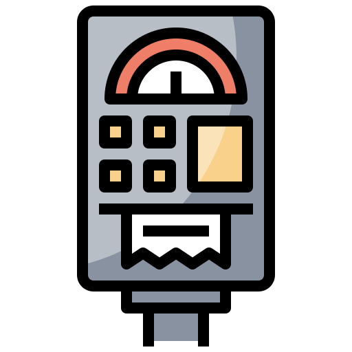

<a id="readme-top"></a>

<!-- PROJECT SHIELDS -->
[![Contributors][contributors-shield]][contributors-url]
[![Forks][forks-shield]][forks-url]
[![Stargazers][stars-shield]][stars-url]
[![Issues][issues-shield]][issues-url]
[![project_license][license-shield]][license-url]


<!-- PROJECT LOGO -->
<br />
<div align="center">
  <a href="https://github.com/ruuffian/paystation">
    
  </a>

<h3 align="center">paystation</h3>

  <p align="center">
    <br />
    <a href="https://github.com/ruuffian/paystation"><strong>Explore the docs »</strong></a>
    <br />
    <br />
    &middot;
    <a href="https://github.com/ruuffian/paystation/issues/new?labels=bug&template=bug-report---.md">Report Bug</a>
    &middot;
    <a href="https://github.com/ruuffian/paystation/issues/new?labels=enhancement&template=feature-request---.md">Request Feature</a>
    &middot;
  </p>
</div>


<!-- TABLE OF CONTENTS -->
<details>
  <summary>Table of Contents</summary>
  <ol>
    <li>
      <a href="#about">About</a>
      <ul>
        <li><a href="#built-with">Built With</a></li>
      </ul>
    </li>
    <li>
      <a href="#getting-started">Getting Started</a>
      <ul>
        <li><a href="#prerequisites">Prerequisites</a></li>
        <li><a href="#installation">Installation</a></li>
      </ul>
    </li>
    <li><a href="#usage">Usage</a></li>
    <li><a href="#roadmap">Roadmap</a></li>
    <li><a href="#contributing">Contributing</a></li>
    <li><a href="#license">License</a></li>
    <li><a href="#contact">Contact</a></li>
    <li><a href="#acknowledgments">Acknowledgments</a></li>
  </ol>
</details>


<!-- ABOUT THE PROJECT -->
## About The Project


This is tied as the most memorable lab that I did in college (the first is 
the shell lab in Operating Systems), despite it's relative simplicity. It 
re-introduced a lot of OOP-concepts that I thought I understood, but did not.
riginal lab was done in Java, but I have decided to revisit it to teach myself 
C++ (and, apparently, CMake).

<p align="right">(<a href="#readme-top">back to top</a>)</p>


<!--### Built With

* [![JQuery][JQuery.com]][JQuery-url]

<p align="right">(<a href="#readme-top">back to top</a>)</p>
-->


<!-- GETTING STARTED -->
## Getting Started

To build and run the project, perform the following:

### Prerequisites

* cmake

`https://cmake.org/download/`

### Installation

1. Clone the repo
   ```sh
   git clone https://github.com/ruuffian/paystation.git
   ```
2. `cd build/`
3. `cmake ..`
4. `make`

<p align="right">(<a href="#readme-top">back to top</a>)</p>


<!-- ROADMAP -->
## Roadmap

- [ ] Cross-Platform support
- [ ] Doxygen
- [ ] GNU Readline support
- [ ] ncurses
- [ ] openGL frontend 


<p align="right">(<a href="#readme-top">back to top</a>)</p>


<!-- CONTRIBUTING -->
## Contributing

If you have a suggestion that would make this better, please fork the repo and create a pull request. You can also simply open an issue with the tag "enhancement".
Don't forget to give the project a star! Thanks again!

1. Fork the Project
2. Create your Feature Branch (`git checkout -b feature/AmazingFeature`)
3. Commit your Changes (`git commit -m 'Add some AmazingFeature'`)
4. Push to the Branch (`git push origin feature/AmazingFeature`)
5. Open a Pull Request

<p align="right">(<a href="#readme-top">back to top</a>)</p>

### Top contributors:

<a href="https://github.com/ruuffian/paystation/graphs/contributors">
  
</a>


<!-- LICENSE -->
## License

Distributed under The Unlicense. See `LICENSE.md` for more information.

<p align="right">(<a href="#readme-top">back to top</a>)</p>


<!-- CONTACT -->
## Contact

ruuffian - [@ruuffian](https://twitter.com/ruuffian) - ruuffian@gmail.com

Project Link: [https://github.com/ruuffian/paystation](https://github.com/ruuffian/repo_name)

<p align="right">(<a href="#readme-top">back to top</a>)</p>


<!-- ACKNOWLEDGMENTS -->
## Acknowledgments

* [The Original Lab](https://github.com/cis3296s23/paystationmain-mackay-shahid-ouedraogo)
* [A Tour of C++ - Bjarne Stroustrup](https://www.google.com/books/edition/A_Tour_of_C++/EXfcAAAAQBAJ?hl=en&gbpv=0)

<p align="right">(<a href="#readme-top">back to top</a>)</p>


<!-- MARKDOWN LINKS & IMAGES -->
<!-- https://www.markdownguide.org/basic-syntax/#reference-style-links -->
[contributors-shield]: https://img.shields.io/github/contributors/ruuffian/paystation.svg?style=for-the-badge
[contributors-url]: https://github.com/ruuffian/paystation/graphs/contributors
[forks-shield]: https://img.shields.io/github/forks/ruuffian/paystation.svg?style=for-the-badge
[forks-url]: https://github.com/ruuffian/paystation/network/members
[stars-shield]: https://img.shields.io/github/stars/ruuffian/paystation.svg?style=for-the-badge
[stars-url]: https://github.com/ruuffian/paystation/stargazers
[issues-shield]: https://img.shields.io/github/issues/ruuffian/paystation.svg?style=for-the-badge
[issues-url]: https://github.com/ruuffian/paystation/issues
[license-shield]: https://img.shields.io/github/license/ruuffian/paystation.svg?style=for-the-badge
[license-url]: https://github.com/ruuffian/paystation/blob/master/LICENSE.md
